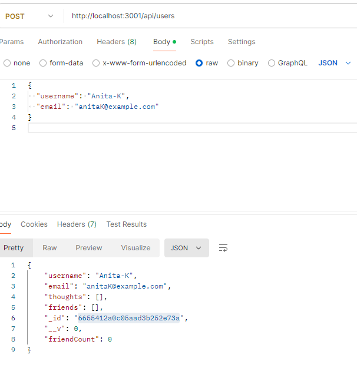

# Social Network API

## Video Link.


[](https://www.gnu.org/licenses/gpl-3.0)


## Table of Contents
- [Description](#description)
- [Installation](#installation)
- [User Story](#user-story)
- [Acceptance Criteria](#acceptance-criteria)
- [Usage](#usage)
- [Tests](#tests)
- [Questions](#questions)
- [Task](#task)
- [License](#license)


## Description


## Installation
You’ll need to use the npm i mongoose npm Install to connect your Express.js 

. Clone the repository to your local machine:

 git clone https://github.com/your/repository.git

. Navigate to the project directory:
 cd repository-name

. Install the required dependencies:
 npm install

.configuration

. Install required packages:

. npm install mongoose 

. Seed data into your database / package.json to set up initial records:
  npm run seed

. Start the server: 

  Launch the Express.js server to run your backend application:
  npm start

## Usage
To effectively use the social network API, follow these steps:

. Testing API Endpoints: Use tools like Postman or Insomnia commands to interact with the API endpoints for testing and validation.

. Authentication and Authorization: Implement user authentication and authorization to secure API routes and control access.

. Database Operations: Utilize Mongoose ODM for MongoDB operations. Define models and perform CRUD (Create, Read, Update, Delete) operations on your database.

. Customize Route Handlers: Customize Express.js route handlers to process different HTTP requests:

. Use GET requests to fetch data from the database.

. Implement POST requests to create new records.

. Handle PUT requests to update existing resources.

. Use DELETE requests to remove data from the database.


. Error Handling: Implement middleware for error handling to provide appropriate responses for different error scenarios.


. Testing and Maintenance: Continuously test the backend application, perform security audits, and maintain code quality for optimal performance and reliability.


## Task

MongoDB is a popular choice for many social networks due to its speed with large amounts of data and flexibility with unstructured data. Over the last part of this course, you’ll use several of the technologies that social networking platforms use in their full-stack applications. Because the foundation of these applications is data, it’s important that you understand how to build and structure the API first.

Your Challenge is to build an API for a social network web application where users can share their thoughts, react to friends’ thoughts, and create a friend list. You’ll use Express.js for routing, a MongoDB database, and the Mongoose ODM. In addition to using the [Express.js](https://www.npmjs.com/package/express) and [Mongoose](https://www.npmjs.com/package/mongoose) packages, you may also optionally use a JavaScript date library of your choice or the native JavaScript `Date` object to format timestamps.

No seed data is provided, so you’ll need to create your own data using Insomnia after you’ve created your API.

Because this application won’t be deployed, you’ll also need to create a walkthrough video that demonstrates its functionality and all of the following acceptance criteria being met. You’ll need to submit a link to the video and add it to the README of your project.

## User Story

```md
AS A social media startup
I WANT an API for my social network that uses a NoSQL database
SO THAT my website can handle large amounts of unstructured data
```

## Acceptance Criteria

```md
GIVEN a social network API
WHEN I enter the command to invoke the application
THEN my server is started and the Mongoose models are synced to the MongoDB database
WHEN I open API GET routes in Insomnia for users and thoughts
THEN the data for each of these routes is displayed in a formatted JSON
WHEN I test API POST, PUT, and DELETE routes in Insomnia
THEN I am able to successfully create, update, and delete users and thoughts in my database
WHEN I test API POST and DELETE routes in Insomnia
THEN I am able to successfully create and delete reactions to thoughts and add and remove friends to a user’s friend list
```

## Test

The following animations show examples of the application's API routes being tested in Postman.
Routes 

GET : http://localhost:3001/api/users
GET: http://localhost:3001/api/users/665282e763e0587664b438f2
GET: http://localhost:3001/api/thoughts
GET:http://localhost:3001/api/thoughts/665282e763e0587664b438f6


POST: http://localhost:3001/api/users

  {
  "username": "Anita-K",
  "email": "anitaK@example.com"
}


POST: http://localhost:3001/api/thoughts

{
  "thoughtText": "I think the earth is circle rathn than sphere.",
  "username": "Anita-K",
  "userId": "6655412a0c05aad3b252e73a" 
}


PUT: http://localhost:3001/api/thoughts/665283cffc787fc162e5b396

{
  "thoughtText": "I think the earth is circle rather than sphere, well we can never really tell as we can't see for ourselves.",
  "username": "Anita-K",
  "userId": "6655412a0c05aad3b252e73a" 
}

POST: http://localhost:3001/api/users/6655412a0c05aad3b252e73a/friends/665283a0fc787fc162e5b394


PUT:http://localhost:3001/api/users/665283a0fc787fc162e5b394

DELETE:http://localhost:3001/api/users/665283a0fc787fc162e5b394
DELETE:http://localhost:3001/api/thoughts/665282e763e0587664b438f2

POST:http://localhost:3001/api/thoughts/6655534c4da083ee5239814f/reactions/

DELETE: http://localhost:3001/api/thoughts/6655534c4da083ee5239814f/reactions/6656822c98c6e20e8fcbc0ee


IMAGES


.png)

.png)





## Questions

- **GitHub**: [daisy isibor](https://github.com/daisy isibor)
- **Email**: daisyisibor9@duck.com

## License
  This project is licensed under the [GPLv3 License](https://www.gnu.org/licenses/gpl-3.0)